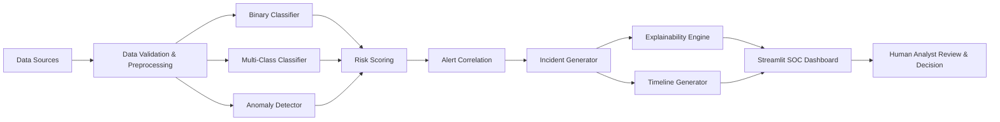

# Sentinel AI

**Turning network noise into explainable, prioritized incidents so human analysts can make accurate decisions in seconds, not hours.**

[](https://www.python.org/downloads/)
[](LICENSE)
[](https://streamlit.io/)

## Project Overview

Security Operations Centers (SOCs) face overwhelming challenges today: alert fatigue, false positives, duplicate alerts, and delayed investigations. Analysts struggle to identify early attack indicators amidst thousands of daily security events, increasing the risk of missing critical threats.

Sentinel AI is an explainable AI-powered SOC assistant that helps human cybersecurity analysts detect malicious activity, reduce false positives, prioritize critical threats, correlate related alerts, visualize attack progression, and generate clear incident summaries.

**Human analysts remain essential.** Sentinel AI supports—not replaces—analysts by providing AI-assisted analysis that accelerates investigation while maintaining human oversight for all critical decisions.

## Quick Start

Get Sentinel AI running in 3 simple steps:

```bash
# 1. Clone the repository
git clone <repository-url>
cd sentinel-ai

# 2. Install dependencies
python -m venv .venv
source .venv/bin/activate  # On Windows: .venv\Scripts\activate
pip install -r requirements.txt

# 3. Run the demo
python scripts/run_demo.py
```

The demo script will:
- ✅ Check dependencies
- ✅ Generate synthetic data
- ✅ Launch the Streamlit dashboard
- ✅ Open in your browser automatically

**That's it!** You'll see the Sentinel AI dashboard with synthetic data ready for exploration.

## Features

- **Binary Intrusion Detection**: Predict Normal vs Attack traffic with high confidence
- **Multi-class Attack Prediction**: Classify attacks into UNSW-NB15 categories (Fuzzers, Analysis, Backdoors, DoS, Exploits, Generic, Reconnaissance, Shellcode, Worms)
- **Anomaly Detection**: Identify unusual behavior using Isolation Forest
- **Risk Scoring**: Transparent, configurable risk scoring with component breakdown
- **Alert Correlation**: Group similar alerts into incidents to reduce fatigue
- **Incident Generation**: Automatic incident creation with deduplication
- **Explainable AI**: SHAP-based explanations with fallback options
- **Attack Timeline**: Visualize attack progression with MITRE ATT&CK heuristic mapping
- **MITRE ATT&CK Mapping**: Heuristic tactic and technique suggestions
- **AI-Assisted Incident Summaries**: Template-based summaries with optional LLM enhancement
- **Analyst Workflow**: Status tracking, notes, and manual override controls
- **Synthetic Demo Mode**: Fully functional offline demonstration mode

## Architecture



## Dataset

### Primary Dataset: UNSW-NB15

Sentinel AI primarily uses the UNSW-NB15 dataset, a comprehensive network intrusion dataset created by the Australian Centre for Cyber Security (ACCS).

**To use UNSW-NB15:**

1. Download the dataset from the official source
2. Place CSV files in `data/raw/`
3. The system will automatically detect and process the files

**Important:**
- Raw datasets are not distributed in this repository
- You must download UNSW-NB15 separately
- Refer to the dataset's licensing terms and ethical use guidelines

### Optional Future Adapters

The architecture supports future adapters for:
- CIC-IDS2017
- CSE-CIC-IDS2018
- TON_IoT
- Bot-IoT
- CTU-13
- Synthetic authentication logs
- Synthetic endpoint logs
- Phishing-email records
- Threat-intelligence enrichment sources

### Training with Real Data

To train models on real UNSW-NB15 data:

```bash
# 1. Download and place UNSW-NB15 files in data/raw/
#    - UNSW_NB15_training-set.csv
#    - UNSW_NB15_testing-set.csv

# 2. Train models
python scripts/train_models.py --data data/raw/UNSW_NB15_training-set.csv

# 3. Evaluate models
python scripts/evaluate_models.py

# 4. Run dashboard with trained models
streamlit run app.py
```
- TON_IoT
- Bot-IoT
- CTU-13
- Synthetic authentication logs
- Synthetic endpoint logs

### Synthetic Sample Data

Synthetic demo data is included in `data/sample/` for immediate testing and demonstration. This data is clearly labeled as demo-only and not representative of real-world performance.

**Note**: The system works immediately in synthetic demo mode without requiring any external datasets or model training.

## Setup Instructions

### Prerequisites

- Python 3.10 or higher
- pip package manager
- Git

### Installation

```bash
git clone <repository-url>
cd sentinel-ai

python -m venv .venv

# Linux/macOS
source .venv/bin/activate

# Windows
.venv\Scripts\activate

pip install -r requirements.txt

cp .env.example .env

python scripts/generate_synthetic_data.py

streamlit run app.py
```

### Model Training

```bash
# Train models on UNSW-NB15 data
python scripts/train_models.py --data data/raw/UNSW_NB15_training-set.csv

# Evaluate model performance
python scripts/evaluate_models.py

# Launch dashboard
streamlit run app.py
```

### Quick Start with Synthetic Data

```bash
# Generate synthetic data
python scripts/generate_synthetic_data.py

# Run the dashboard (will use synthetic data automatically)
streamlit run app.py

# OR use the demo script for a complete demo experience
python scripts/run_demo.py
```

## Model and Evaluation

### Model Choices

- **Binary Classifier**: LightGBM (preferred), XGBoost, or HistGradientBoostingClassifier (fallback)
- **Multi-class Classifier**: LightGBM, XGBoost, or HistGradientBoostingClassifier
- **Anomaly Detector**: Isolation Forest

### Preprocessing Approach

- Schema validation and standardization
- Missing value handling (configurable: mean, median, most_frequent, drop)
- Infinite value replacement
- Categorical encoding (label or one-hot)
- Numerical scaling (standard, minmax, robust, or none)
- Deterministic random seeds for reproducibility

### Data Split

- Prefer official training/test partitions when available
- Otherwise: stratified train/validation/test split
- Typical split: 70% train, 20% test, 10% validation
- No leakage from test to training data

### Evaluation Metrics

- Accuracy, Precision, Recall, F1-score
- Macro and weighted F1-scores
- ROC-AUC (binary model)
- PR-AUC (binary model)
- Confusion matrix
- Per-class metrics
- Inference latency
- Class distribution summary

### Class Imbalance Strategy

- Class weighting or sample weighting
- Configurable via settings
- Preserves minority class performance

### Explainability Method

- SHAP TreeExplainer for tree-based models
- Feature importance fallback
- Local deviation-from-baseline fallback
- Plain-language evidence generation

### Limitations

- Dataset bias may affect real-world performance
- Concept drift requires model retraining
- Benchmark results don't guarantee production performance
- False positives and false negatives are possible
- MITRE mappings are heuristic, not definitive
- Requires analyst validation for all findings

## Human-in-the-Loop Safety

**Critical: Sentinel AI provides AI-assisted analysis.**

- ✅ Analysts validate all findings
- ✅ Analysts approve all response actions
- ✅ Model explanations are evidence, not proof
- ✅ MITRE mappings are heuristic suggestions
- ✅ Benchmark results don't guarantee production performance
- ❌ No autonomous blocking, containment, or remediation
- ❌ No automated response decisions
- ❌ No credential harvesting or unauthorized access

## Safety Notice

> **Sentinel AI provides AI-assisted analysis. Human analyst validation is required before response actions.**

## Limitations

- **Dataset Bias**: Trained on specific datasets, may not generalize
- **Concept Drift**: Network patterns change over time
- **Benchmark-to-Production Gap**: Lab results ≠ real-world performance
- **False Positives**: Normal traffic may be flagged
- **False Negatives**: Attacks may be missed
- **Incomplete Telemetry**: Limited by available data
- **Heuristic Correlation**: May group unrelated events
- **Heuristic MITRE Mapping**: Not definitive technique identification
- **Analyst Validation Required**: AI outputs need human review
- **LLM Limitations**: If enabled, summarization may have errors

## Future Work

- Real SIEM integration
- Live telemetry ingestion
- Additional dataset adapters
- SOAR integration with approval workflows
- Better entity resolution
- Continuous learning and drift detection
- Role-based access control
- Threat intelligence integrations
- Enterprise deployment options
- Advanced correlation algorithms
- Ensemble methods for improved accuracy

## Documentation

- [Architecture Documentation](docs/architecture.md)
- [Model Card](docs/model_card.md)
- [Dataset Card](docs/dataset_card.md)
- [Threat Model](docs/threat_model.md)
- [Demo Script](docs/demo_script.md)

## Responsible Use

Sentinel AI is a defensive cybersecurity tool designed to help security analysts. It should:

- Be used only for authorized security monitoring
- Comply with organizational privacy policies
- Require human analyst oversight
- Follow applicable laws and regulations

It should not be used for:

- Unauthorized surveillance
- Privacy violations
- Offensive operations
- Denial of service attacks
- Any malicious activity

## License

[Specify your license here]

## Contributing

[Specify contribution guidelines here]

## Support

For support, please visit [your support channel] or open an issue in the repository.

## Citation

If you use Sentinel AI in your research or work, please cite:

```
Sentinel AI: An Explainable AI-Powered Security Operations Center Assistant
Version 1.0.0
https://github.com/your-org/sentinel-ai
```

## Troubleshooting

### Common Issues

**Issue**: "Module not found" errors
- **Solution**: Ensure you've activated the virtual environment and installed dependencies: `pip install -r requirements.txt`

**Issue**: Synthetic data not loading
- **Solution**: Run `python scripts/generate_synthetic_data.py` to generate sample data

**Issue**: Dashboard won't start
- **Solution**: Ensure Streamlit is installed: `pip install streamlit` and check Python version (3.10+ required)

**Issue**: Model training fails
- **Solution**: Ensure you have sufficient memory and that the dataset is properly formatted

**Issue**: SHAP import errors
- **Solution**: The system uses fallbacks when SHAP is unavailable. For full explainability, install SHAP: `pip install shap`

### Getting Help

- **Documentation**: Check the `docs/` directory for detailed documentation
- **Issues**: Report issues via GitHub issue tracker
- **Community**: Join discussions in the project community forum

## Contributing

We welcome contributions! Please see our contributing guidelines for details on:
- Code of conduct
- Development workflow
- Pull request process
- Coding standards

## License

This project is licensed under the MIT License - see the LICENSE file for details.

## Acknowledgments

- **UNSW-NB15 Dataset**: Australian Centre for Cyber Security (ACCS)
- **ML Frameworks**: Scikit-learn, LightGBM, XGBoost communities
- **Security Community**: SOC analysts and researchers who provided feedback
- **Open Source**: The broader open-source security community

## Disclaimer

**Important**: Sentinel AI is a defensive cybersecurity tool designed to help security analysts. It should:

- Be used only for authorized security monitoring
- Comply with organizational privacy policies
- Require human analyst oversight
- Follow applicable laws and regulations

It should not be used for:

- Unauthorized surveillance
- Privacy violations
- Offensive operations
- Denial of service attacks
- Any malicious activity

## Contact

- **Support**: [your support channel]
- **Issues**: [GitHub issues]
- **Email**: [contact email]

---

**Version**: 1.0.0  
**Last Updated**: 2025-08-29  
**Status**: Production Ready (Synthetic Demo Mode)

## Acknowledgments

- UNSW-NB15 dataset creators
- Security analysts who provided feedback
- Open-source security community

---

**Version**: 1.0.0  
**Last Updated**: 2025-08-29
