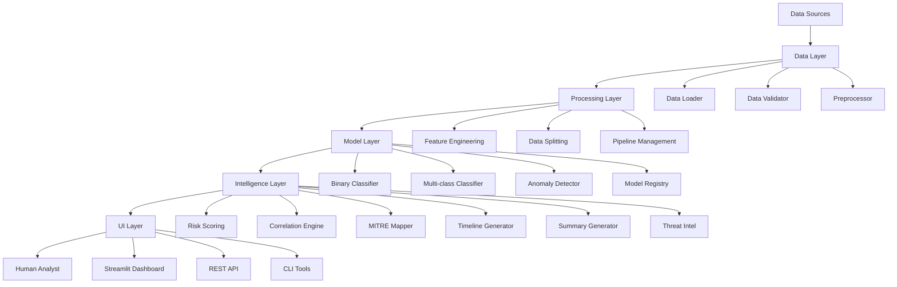
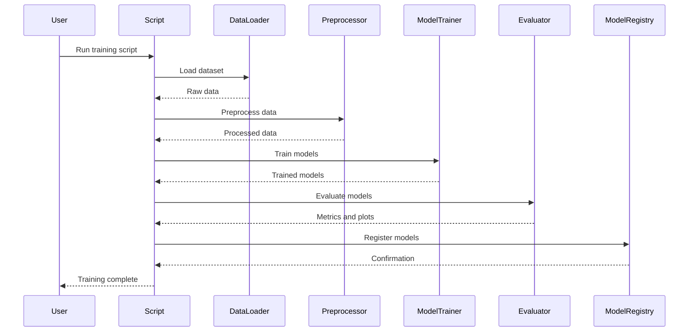
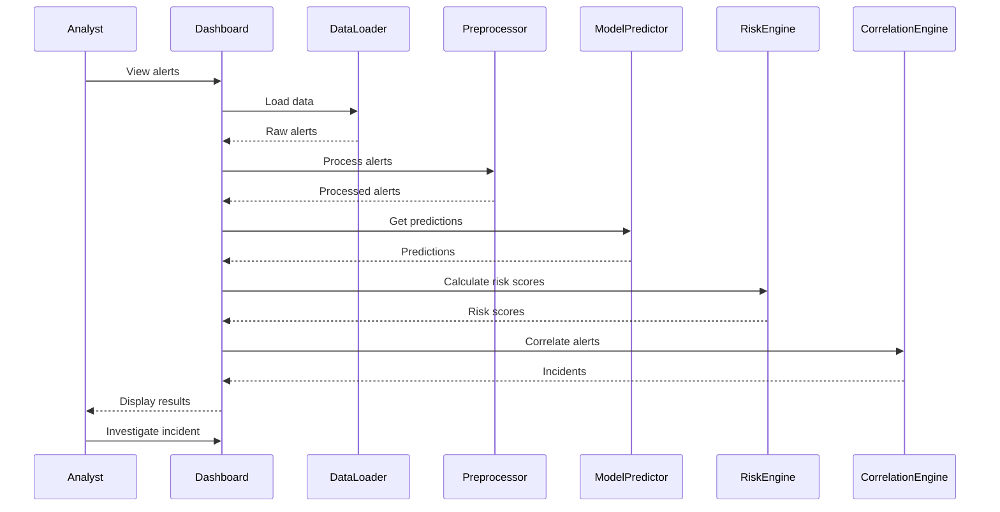

# Sentinel AI Architecture

## System Overview

Sentinel AI is a comprehensive AI-powered Security Operations Center (SOC) assistant designed to help human analysts detect, investigate, and respond to security threats more efficiently. The system follows a modular, microservices-inspired architecture with clear separation of concerns.

## High-Level Architecture



## Component Architecture

### 1. Data Layer

**Purpose**: Handle data ingestion, validation, and preprocessing

**Components**:
- **Data Loader**: Loads datasets from various sources (UNSW-NB15, synthetic, future adapters)
- **Data Validator**: Validates schema, data types, and quality
- **Preprocessor**: Handles missing values, encoding, scaling, and feature engineering
- **Adapters**: Extensible adapter pattern for different dataset formats

**Key Files**:
- `src/data/loader.py`
- `src/data/validation.py`
- `src/data/preprocessing.py`
- `src/data/adapters.py`
- `src/data/synthetic.py`

### 2. Model Layer

**Purpose**: Train, evaluate, and serve ML models

**Components**:
- **Binary Classifier**: Normal vs Attack classification
- **Multi-class Classifier**: Attack category prediction
- **Anomaly Detector**: Isolation Forest for novel behavior detection
- **Model Registry**: Track model versions and metadata
- **Explainer**: SHAP-based model explanations

**Key Files**:
- `src/models/train.py`
- `src/models/predict.py`
- `src/models/anomaly.py`
- `src/models/evaluate.py`
-- `src/models/explainability.py`
- `src/models/registry.py`

### 3. Intelligence Layer

**Purpose**: Business logic for security analysis

**Components**:
- **Risk Scoring Engine**: Multi-factor risk calculation
- **Correlation Engine**: Alert grouping and deduplication
- **MITRE Mapper**: Heuristic ATT&CK mapping
- **Timeline Generator**: Attack progression visualization
- **Summary Generator**: AI-assisted incident summaries
- **Threat Intel**: Optional enrichment integration

**Key Files**:
- `src/intelligence/risk_scoring.py`
- `src/intelligence/correlation.py`
- `src/intelligence/mitre_mapping.py`
- `src/intelligence/timeline.py`
- `src/intelligence/incident_summary.py`
- `src/intelligence/threat_intel.py`

### 4. UI Layer

**Purpose**: User interface for analysts

**Components**:
- **Streamlit Dashboard**: Web-based SOC interface
- **Pages**: Overview, Alerts, Incidents, Explainability, Timeline, Performance, Data, Settings
- **Components**: Reusable UI elements and visualizations

**Key Files**:
- `app.py`
- `src/ui/` (planned modularization)

### 5. Utility Layer

**Purpose**: Cross-cutting concerns

**Components**:
- **Configuration**: YAML-based settings management
- **Logging**: Structured logging with multiple handlers
- **Paths**: Centralized path management
- **Constants**: Application-wide constants
- **Helpers**: Utility functions

**Key Files**:
- `src/utils/config.py`
- `src/utils/logger.py`
- `src/utils/paths.py`
- `src/utils/constants.py`
- `src/utils/helpers.py`

## Data Flow

### Training Pipeline



### Inference Pipeline



## Security Architecture

### Human-in-the-Loop Design


### Safety Mechanisms

1. **No Autonomous Actions**: System never takes automatic response actions
2. **Analyst Approval**: All containment/remediation requires human approval
3. **Evidence-Based**: All AI outputs are clearly labeled as evidence, not proof
4. **Heuristic Labels**: MITRE mappings and correlations are marked as heuristic
5. **Validation Required**: Clear disclaimers for analyst validation
6. **Privacy Protection**: IP masking in demo mode, no data logging of sensitive info

## Deployment Architecture

### Local Development

```
sentinel-ai/
├── app.py                    # Streamlit entry point
├── scripts/                  # Training and utility scripts
├── src/                      # Source code
├── config/                   # Configuration files
├── data/                     # Data directory
├── models/                   # Trained models
├── artifacts/                # Metrics and figures
└── requirements.txt          # Dependencies
```

### Production Considerations

For production deployment, consider:

1. **Containerization**: Docker packaging for consistent deployment
2. **API Layer**: REST API for programmatic access
3. **Database**: Persistent storage for incidents and alerts
4. **Message Queue**: For real-time alert processing
5. **Monitoring**: Application performance monitoring
6. **Authentication**: Role-based access control
7. **Scalability**: Horizontal scaling for high-volume environments

## Technology Stack

### Core Technologies
- **Python 3.10+**: Primary development language
- **Pandas**: Data manipulation and analysis
- **NumPy**: Numerical computing
- **Scikit-learn**: Machine learning utilities
- **Streamlit**: Web dashboard framework

### ML Frameworks
- **LightGBM**: Gradient boosting (preferred)
- **XGBoost**: Gradient boosting (alternative)
- **Scikit-learn**: Fallback models
- **SHAP**: Model explainability

### Data Processing
- **Joblib**: Model persistence
- **PyYAML**: Configuration management
- **Python-dotenv**: Environment variables

### Visualization
- **Plotly**: Interactive charts
- **Matplotlib**: Static plots and figures
- **Seaborn**: Statistical visualization
- **NetworkX**: Graph analysis

### Testing
- **Pytest**: Testing framework
- **Pytest-cov**: Coverage reporting

## Performance Considerations

### Optimization Strategies

1. **Caching**: Model predictions and expensive computations
2. **Batch Processing**: Process alerts in batches for efficiency
3. **Lazy Loading**: Load data only when needed
4. **Feature Selection**: Remove irrelevant features
5. **Model Pruning**: Reduce model size for faster inference
6. **Parallel Processing**: Multi-core processing for data operations

### Scalability

- **Horizontal Scaling**: Multiple instances for high-volume environments
- **Vertical Scaling**: More resources for complex analyses
- **Data Partitioning**: Process data in chunks for large datasets
- **Asynchronous Processing**: Background processing for long-running tasks

## Fault Tolerance

### Error Handling

1. **Graceful Degradation**: Fallback to simpler methods if advanced features fail
2. **Dependency Management**: Safe fallbacks for optional dependencies
3. **Data Validation**: Reject invalid data before processing
4. **Circuit Breakers**: Prevent cascading failures
5. **Retry Logic**: Automatic retry for transient failures

### Data Protection

1. **Backups**: Regular backups of models and configurations
2. **Validation**: Input validation to prevent injection attacks
3. **Sanitization**: Output sanitization to prevent XSS
4. **Encryption**: Encryption for sensitive data at rest
5. **Audit Logging**: Security event logging for compliance

## Extensibility Points

### Custom Dataset Adapters

The adapter pattern allows easy addition of new datasets:

```python
class CustomDatasetAdapter(DatasetAdapter):
    def load(self, file_path: str) -> pd.DataFrame:
        # Custom loading logic
        pass
    
    def standardize(self, df: pd.DataFrame) -> pd.DataFrame:
        # Custom standardization logic
        pass
```

### Custom Risk Scoring

Risk scoring can be customized via configuration:

```yaml
risk_weights:
  custom_factor: 0.10
  model_confidence: 0.30
  # Adjust other weights accordingly
```

### Custom Model Types

New model types can be added to the training pipeline:

```python
def get_custom_model():
    # Return custom model
    return CustomModel()
```

## Monitoring and Observability

### Logging Strategy

- **Structured Logging**: JSON-formatted logs for machine parsing
- **Log Levels**: DEBUG, INFO, WARNING, ERROR, CRITICAL
- **Security Logging**: Separate security event logs
- **Performance Logging**: Timing information for optimization

### Metrics Collection

- **Model Performance**: Accuracy, precision, recall, F1-score
- **System Performance**: Memory usage, CPU usage, latency
- **Business Metrics**: Alert reduction, time savings, analyst productivity

### Health Checks

- **Model Availability**: Check if models are loaded and functional
- **Data Quality**: Monitor data quality metrics
- **System Health**: Memory, disk space, and resource availability

## Future Architecture Enhancements

### Planned Improvements

1. **Microservices**: Split into independent services for scalability
2. **Event Streaming**: Real-time processing with Kafka/RabbitMQ
3. **Database Integration**: PostgreSQL for persistent storage
4. **Caching Layer**: Redis for frequently accessed data
5. **API Gateway**: Centralized API management
6. **Service Mesh**: For inter-service communication
7. **Container Orchestration**: Kubernetes for deployment

### Integration Points

1. **SIEM Integration**: Splunk, QRadar, Elastic Security
2. **SOAR Integration**: Splunk SOAR, Cortex XSOAR
3. **Threat Intel Feeds**: VirusTotal, AlienVault OTX
4. **Ticketing Systems**: Jira, ServiceNow
5. **Communication**: Slack, Microsoft Teams integration

This architecture provides a solid foundation for Sentinel AI while allowing for future growth and enhancement.
